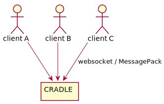
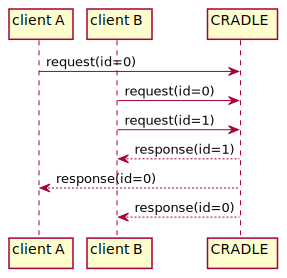
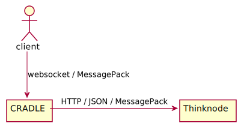
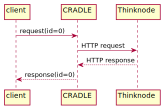
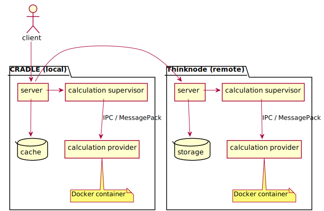

# Introduction
Clients interact with CRADLE via a websocket interface, where data is encoded via MessagePack:

Requests are identified by an id that is set by the client.
Requests are asynchronous; CRADLE sends responses back to the originating client, where
the response includes the request id that was sent by the client:

CRADLE will calculate the response itself when it can; otherwise, it will get it from the remote
Thinknode, and translate it into a response to the client.

Requests between CRADLE and Thinknode tend to be functionally similar to the ones between clients and CRADLE.
The protocols are different though: Thinknode is accessed via HTTP, and data is encoded in JSON or MessagePack.

Thinknode forbids messages with JSON data size exceeding 5MB; MessagePack is required for those situations.
Consequently, CRADLE uses MessagePack for storing and retrieving immutable objects (that could be too large), and
JSON otherwise.

CRADLE and Thinknode have similar designs:

The local CRADLE provides similar functionality as the remote Thinknode.
The components are:

* A server processing incoming requests, and sending back responses.
* Storage for immutable data. In case of Thinknode, storage is permanent; CRADLE uses a
  cache where items can be evicted on an LRU basis.
* A calculation provider, which is a Docker container performing calculations.
* A calculation supervisor, forming the interface between server and calculation provider.

Docker images are identical between CRADLE and Thinknode;
CRADLE retrieves a Docker image from Thinknode when it is not yet available.
As the same Docker image is used for remote and local calculation, the interface between
supervisor and provider must be identical as well; it is based on IPC, using MessagePack
for encoding structured data.

CRADLE locally caches objects; more [here](cache.md).

Several options exist for the request processing in CRADLE:

* The server needs no interaction with other blocks. This is the simple and uncommon case
  (registration, test, kill, ...).
* The requested data is already present in the cache.
* The requested data needs to be retrieved from Thinknode. If possible,
  the data is cached so that a following request for the same data need not go
  to the remote server again.
* The request is for a local calculation, and is performed by the local calculation provider.
  Again, results are stored in the cache wherever possible.
