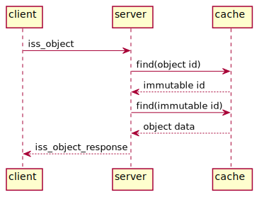

# `iss_object`: retrieve an immutable object
An `iss_object` request asks to retrieve the data for an immutable object. Example message:

```
request_id: e7ea249f40ff4ae38a304018abfbda8c
content:
  iss_object:
	context_id: 0123456789abcdef0123456789abcdef
	encoding: msgpack
	ignore_upgrades: false
	object_id: 5ac4e6f900c0034d5469e872024b8705
```

The fields are:

* `request_id`: identifies this request; set by the client
* `context_id`: see [here](data.md)
* `encoding`: will usually be `msgpack`
* `ignore_upgrades`: will usually be false
* `object_id`: identifies the object; this is a reference id, not an immutable id

Example response:

```
request_id: e7ea249f40ff4ae38a304018abfbda8c
content:
  iss_object_response:
    object: (MessagePack data)
```

The fields are:

* `request_id`: copied from the request message
* `object`: data for the immutable object, encoded as per the `encoding` in the request message


## Cache keys
The cache key for an immutable id is a hash depending on:

* The key type (`resolve_iss_object_to_immutable`)
* The API URL (e.g. `https://mgh.thinknode.io/api/v1.0`)
* The context id (unless `ignore_upgrades` is true)
* The object id

The cache key for the object data itself is a hash depending on:

* The key type (`retrieve_immutable`)
* The API URL (e.g. `https://mgh.thinknode.io/api/v1.0`)
* The immutable id


## Cache hit
If the data is already present in CRADLE's cache, the interaction looks like



The steps are:

* The client asks CRADLE for an immutable object's data, by sending an `object_id`
* CRADLE translates `object_id`, which is a reference id, into the corresponding `immutable_id`.
  It first translates the `object_id` into a cache lookup key, then tries to find that entry in the cache;
  in this case, it's present.
* CRADLE then translates the `immutable_id` into a second cache lookup key, and tries to find that entry in the cache;
  again, it's present, and contains the data for the immutable object. The data is serialized and possibly compressed.
* CRADLE uncompresses the data if needed, deserializes it, and puts it in an `iss_object_reponse` message
  that it sends to the client.

## Cache miss
If the immutable object is not yet present in CRADLE's cache, CRADLE will retrieve it from Thinknode,
and store it in the cache:


