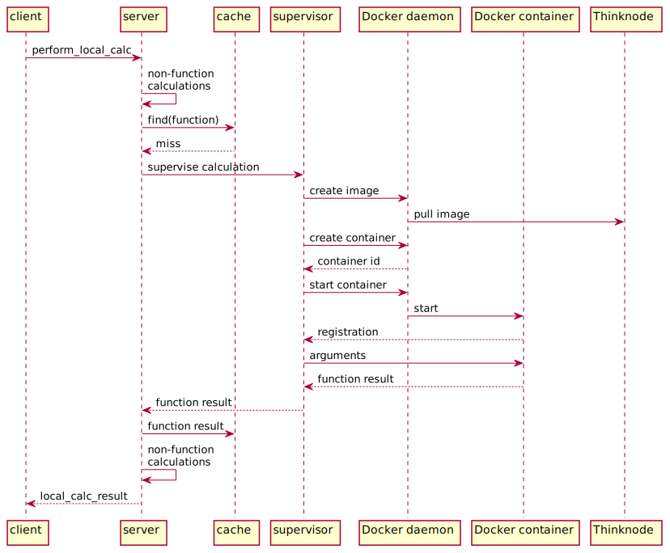

# `perform_local_calc`: perform a calculation on the local machine
A `perform_local_calc` request asks to perform a calculation on the local machine,
using a Docker container. Example message:

```
request_id: 7bffaa8e985040afb9af8f634d38928c
content:
  perform_local_calc:
    calculation:
      let:
        in:
          function:
            account: mgh
            app: dosimetry
            args:
              - variable: x
              - value: 0.555123185675
            name: addition
        variables:
          x:
            function:
              account: mgh
              app: dosimetry
              args:
                - value: 0.319671638696
                - value: 0.157121711959
              name: addition
    context_id: 5dadeb4a004073e81b5e096255e83652
```

The fields are:

* `request_id`: identifies this request; set by the client
* `context_id`: see [here](data.md)
* `calculation`: the calculation to perform: an addition of three values, using an intermediate
  calculation setting variable `x`

Example response:

```
request_id: 7bffaa8e985040afb9af8f634d38928c
content:
  local_calc_result: 1.03191653633
```

The fields are:

* `request_id`: copied from the request message
* `local_calc_result`: the calculation result (the addition of the three input values)


## Perform a calculation
The server recursively evaluates the specified calculation:

* A `reference` is resolved similar to a [`iss_object`](msg_iss_object.md) request.
* A `function` is executed on the Docker container, via the calculation supervisor; see below.
* Other calculation components are evaluated by the server itself.


## Calculating functions
For calculating functions, the CRADLE server interacts with:

* Cache: stores function return values
* Docker daemon: creates and starts the Docker container
* Thinknode (via the daemon): provides the Docker image
* Calculation supervisor: performs function calculations, using the calculation provider
* Calculation provider (Docker container): to actually perform the function calculation



