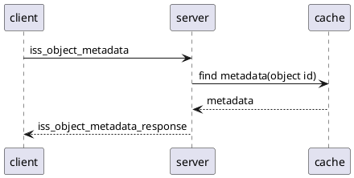
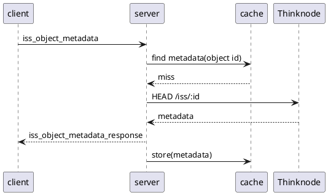

# `iss_object_metadata`: retrieve metadata for an immutable object
An `iss_object_metadata` request asks to retrieve the metadata for an immutable object. Example message:

```
request_id: 742ee20dc71d4d1ba033c73926301b1b
content:
  iss_object_metadata:
    context_id: 0123456789abcdef0123456789abcdef
    object_id: 5ac4e6f800c084d9564be9b578d35b58
```

The fields are:

* `request_id`: identifies this request; set by the client
* `context_id`: see [here](data.md)
* `object_id`: identifies the object; this is a reference id, not an immutable id

Example response:

```
request_id: 742ee20dc71d4d1ba033c73926301b1b
content:
  iss_object_metadata_response:
    metadata:
      Access-Control-Allow-Credentials: "true"
      Access-Control-Allow-Origin: "*"
      Cache-Control: max-age=60
      Connection: keep-alive
      Content-Type: application/octet-stream
      Date: Mon, 10 Jan 2022 15:44:25 GMT
      ETag: sF.......................................go=
      Server: nginx
      Thinknode-Created-At: Wed Apr 04 2018 14:53:44 GMT+0000 (UTC)
      Thinknode-Created-By: cradle_test_bot
      Thinknode-Reference-Id: 5ac4e6f800c084d9564be9b578d35b58
      Thinknode-Size: "25"
      Thinknode-Type: float
      X-Powered-By: Express
```

The fields are:

* `request_id`: copied from the request message
* `metadata`: the response header fields in the HTTP response received from Thinknode

This example response corresponds to a 200 status code. Thinknode may also return
other status codes, in particular 202, which causes CRADLE to start a polling loop
waiting for the final answer.


## Cache key
CRADLE will cache the response it gets from Thinknode.
The cache key is a hash depending on:

* The key type (`get_iss_object_metadata`)
* The API URL (e.g. `https://mgh.thinknode.io/api/v1.0`)
* The context id
* The object id


## Cache hit
If the data is already present in CRADLE's cache, the interaction looks like



## Cache miss
If the metadata is not yet present in CRADLE's cache, CRADLE will retrieve it from Thinknode,
and store it in the cache:


