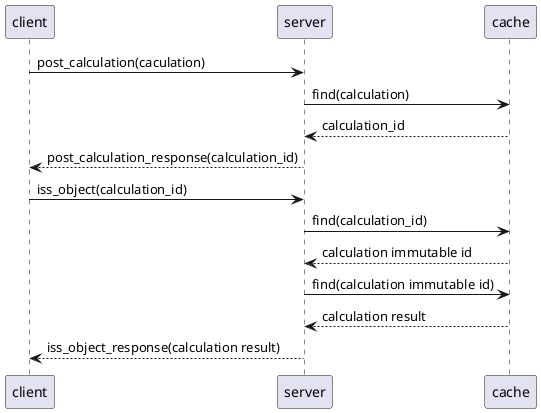
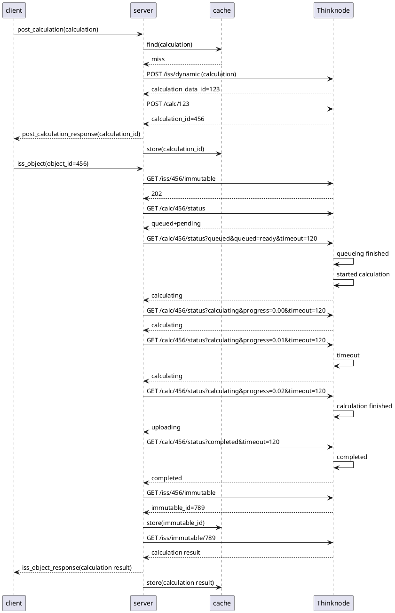

# `post_calculation`: perform a calculation on Thinknode
An `post_calculation` request asks to perform a calculation on Thinknode. Example message:

```
request_id: 706a4284d5a04cb9a7ce7100a943466f
content:
  post_calculation:
    context_id: 5dadeb4a004073e81b5e096255e83652
    calculation:
      let:
        in:
          function:
            account: mgh
            app: dosimetry
            args:
              - variable: x
              - value: 0.432170778402
            name: addition
        variables:
          x:
            function:
              account: mgh
              app: dosimetry
              args:
                - value: 0.974969247066
                - value: 0.481284089997
              name: addition
```

The fields are:

* `request_id`: identifies this request; set by the client
* `context_id`: see [here](data.md)
* `calculation`: the calculation to perform

Example response:

```
request_id: 706a4284d5a04cb9a7ce7100a943466f
content:
  post_calculation_response:
    calculation_id: 61dc545b0100b54ba8be0e36778221d5
```

The fields are:

* `request_id`: copied from the request message
* `calculation_id`: identifies the result from the completed calculation

The client would follow up with an [`iss_object`](msg_iss_object.md) request to
retrieve the object specified by `calculation_id`.

## Cache hit
If the calculation result is already present in CRADLE's cache, the interaction looks like



This picture is rather simplified: CRADLE will break down the requested calculation into pieces,
and try to resolve each piece from the cache.

> TODO more here.


## Cache miss
If the calculation result is not yet present in CRADLE's cache, CRADLE will post the
calculation to Thinknode, and wait until Thinknode has completely finished the calculation,
e.g.



Again, CRADLE will break down the calculation into pieces. Each piece leads to two
POST requests to Thinknode:

* The first one posts the calculation piece, which becomes an immutable object;
  Thinknode returns its reference id (a calculation data id), which will be used in higher-level
  calculation pieces (if any), and will be used in the following post request.
* The second request has an empty body and creates an immutable object representing
  the calculation itself; Thinknode returns a corresponding calculation id.

The `calculation_id` in the sequence diagram is the last one returned by Thinknode, and
represents the entire calculation. CRADLE returns this id to the client; it is also the one
used to monitor progress of the entire calculation.
