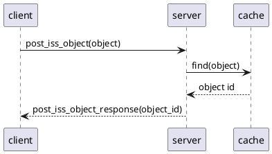
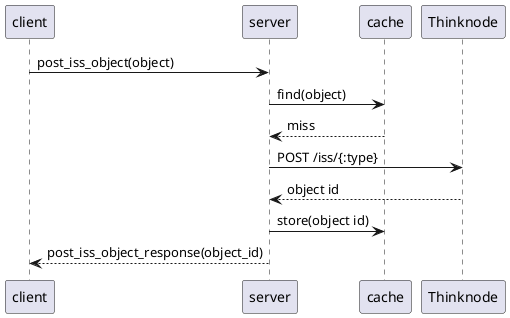

# `post_iss_object`: store an immutable object
A `post_iss_object` request asks to store the data for an immutable object;
CRADLE returns a reference id for the data to the client, and caches that id.
It does *not* cache the data itself: that would require an immutable id,
which Thinknode does not return in its response.
As a consequence, another identical `post_iss_object` request
would be served from the cache, but an `iss_object` request specifying
the same reference id would still cause a cache miss, and would be resolved
by Thinknode first.

Assuming that a recently posted object will soon be needed
again, CRADLE could retrieve the immutable id from Thinknode in its processing the
`post_iss_object` request; then it would have all needed information to
cache the object data too.

Example message:

```
request_id: 9f0eb0a45fcf438db785e30b1ebb57be
content:
  post_iss_object:
	context_id: 5dadeb4a004073e81b5e096255e83652
	encoding: msgpack
    object: (MessagePack data)
	schema: string
```

The fields are:

* `request_id`: identifies this request; set by the client
* `context_id`: see [here](data.md)
* `encoding`: will usually be `msgpack`
* `object`: data for the immutable object, encoded as per `encoding`
* `schema`: describes the structure of the object's data

Example response:

```
request_id: 9f0eb0a45fcf438db785e30b1ebb57be
content:
  post_iss_object_response:
    object_id: 5ac4e6f700c0fb7a4baeadcf659fa217
```

The fields are:

* `request_id`: copied from the request message
* `object_id`: reference id for the stored object


## Cache key
The cache key is a hash depending on:

* The key type (`post_iss_object`)
* The API URL (e.g. `https://mgh.thinknode.io/api/v1.0`)
* The context id
* The schema
* The account name if the schema includes named types
* The object data


## Cache hit
If CRADLE already received an identical `post_iss_object` request, and did not yet
evict the corresponding object id from its cache,
the interaction looks like



## Cache miss
If the cache does not contain the object id for the immutable object,
then CRADLE will post the object to Thinknode, and cache the object id that Thinknode returns:


